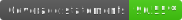

# How to run the project locally
1. Copy the `.env.template` file and rename it to `.env`. Replace the placeholder text for `BOT_TOKEN` with the valid token.
2. Install dependencies with `npm run install`.
3. You can build the project using `npm run build` or use `npm-watch` to rebuild automatically the project on changes.
4. Get the bot up and running with `npm start`.
